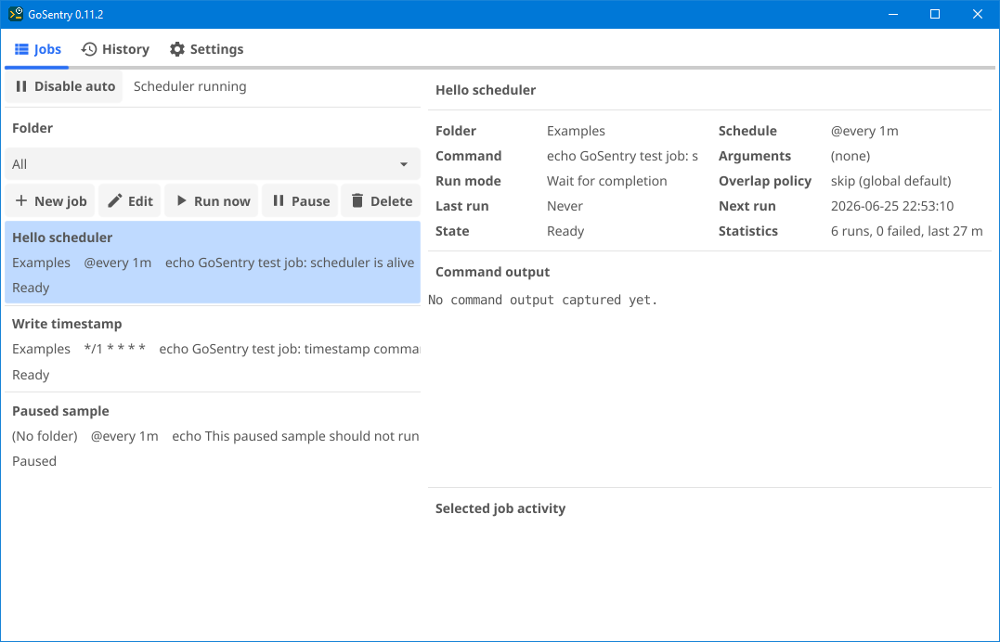
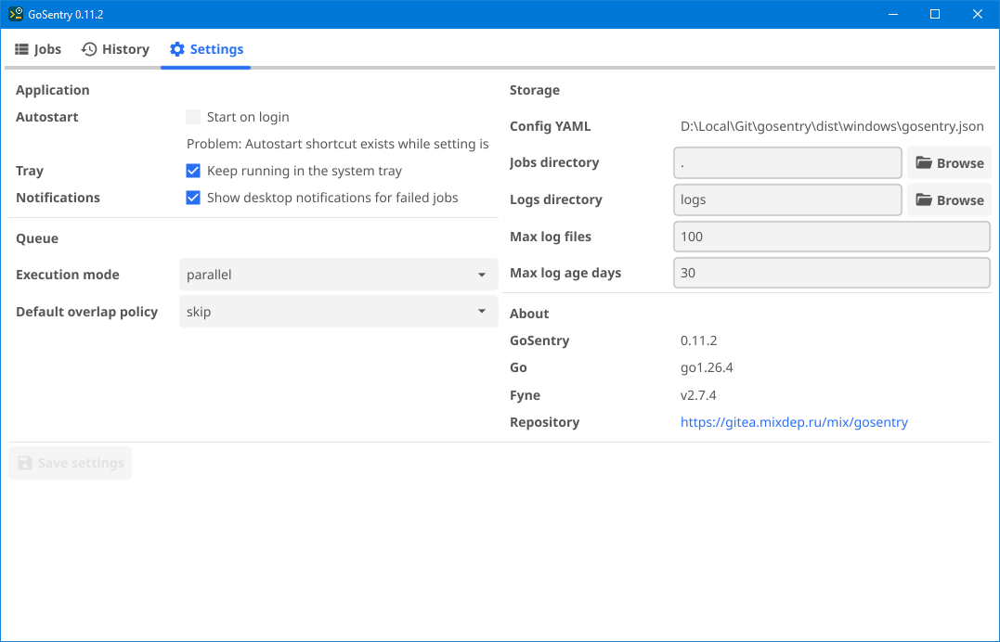

# GoSentry

GoSentry is a cross-platform desktop scheduler. It provides a native GUI for
creating, grouping, pausing, running, and monitoring scheduled shell commands.

## Screenshots

<table>
<tr>
<td align="center"><br><em>Jobs tab — job list with details panel and run statistics.</em></td>
<td align="center"><br><em>Settings tab — application, queue, storage, and version info.</em></td>
</tr>
</table>

## Features

- Native desktop GUI built with [Fyne](https://fyne.io/).
- Job definitions stored in a clean, hand-editable `jobs.json`.
- `@every` intervals and standard 5-field cron expressions.
- Manual and scheduled command runs.
- Parallel or sequential execution mode; configurable overlap policy (skip or queue).
- Per-run `.log` files with stdout/stderr capture.
- Log cleanup by maximum file count and maximum age.
- Global pause/resume for scheduled job execution (manual runs remain available).
- Desktop notifications on job failure.
- Windows tray icon: left-click to show the window, right-click for the menu.
- Autostart on login (Windows shortcut; Linux XDG desktop entry).

## Documentation

- [Changelog](docs/CHANGELOG.md)
- [Roadmap](docs/ROADMAP.md)
- [Architecture](docs/ARCHITECTURE.md)
- [Development](docs/DEVELOPMENT.md) — build instructions, project layout, dependencies

## Storage

GoSentry stores its files next to the executable by default, making it a
portable application: moving the program folder also moves its configuration.

`gosentry.json` stores application settings:

```json
{
  "jobs_dir": ".",
  "logs_dir": "logs",
  "max_log_files": 100,
  "max_log_age_days": 30,
  "keep_running_in_tray": true,
  "notify_on_failure": true,
  "execution_mode": "parallel",
  "overlap_policy": "skip"
}
```

`jobs.json` stores job definitions:

```json
{
  "jobs": [
    {
      "id": 1,
      "name": "Hello scheduler",
      "folder": "Examples",
      "schedule": "@every 1m",
      "command": "echo GoSentry test job: scheduler is alive",
      "enabled": true
    }
  ]
}
```

`jobs_dir` is the directory GoSentry reads `jobs.json` from. The default `"."`
means the same folder as the executable. An absolute path can be used when jobs
should live elsewhere, such as a shared network drive.

`logs_dir` is relative to the program folder when it does not start with a
drive letter or `/`.

Command output is written to separate files under `logs_dir`. File names
include the run timestamp and job name:

```text
20260614-224306_Hello_scheduler.log
```

## Schedules

Interval schedules using Go duration syntax:

```text
@every 10s
@every 5m
@every 1h30m
```

Standard 5-field cron expressions:

```text
*/5 * * * *      every five minutes
0 2 * * *        every day at 02:00
30 9 * * 1-5     weekdays at 09:30
```

## Using The App

1. Start GoSentry.
2. Use **New job** to create a scheduled command.
3. Set **Schedule**, **Command**, optional **Arguments**, **Folder**, and **Enabled**.
4. Use **Run now** for a one-off manual run without waiting for the schedule.
5. Use **Pause** on a single job to suspend it without deleting it.
6. Use **Pause all** as a global stop switch for all scheduled runs.
7. Open **History** to see past runs, their trigger (`Manual`, `Schedule`, or `UI`), state, and log file.
8. Open **Settings** to change storage directories, log cleanup limits, queue behavior, and notifications.

Changing `jobs_dir` in Settings saves the current job list to the new directory.

The **Start on login** checkbox shows an `OK` or `Problem` status. Saving with
it enabled writes an autostart entry using the current executable path.
Autostart entries include `--start-in-tray` so scheduled jobs run after sign-in
without opening the main window.

## Queue Settings

Two settings in the **Queue** group of the Settings tab control how simultaneous
and overlapping runs are handled.

**Execution mode** — applies when multiple jobs become due at the same tick:

| Value | Behaviour |
|-------|-----------|
| `parallel` (default) | All due jobs start at the same time. |
| `sequential` | Due jobs are started one after another, in the order they appear in the list. |

**Overlap policy** — applies when a job's next scheduled run fires while its
previous run is still active:

| Value | Behaviour |
|-------|-----------|
| `skip` (default) | The new run is discarded; the running instance continues. |
| `queue` | The new run is held and starts immediately after the current run finishes. |

## Notifications

When **Notify on failure** is enabled in Settings, GoSentry sends a desktop
notification whenever a scheduled or manual run exits with a non-zero exit code.
The notification shows the job name and the exit code.

## Autostart

GoSentry is a user desktop application, not a system daemon, so autostart is
configured per user.

Linux:

```ini
# GoSentry writes an XDG Autostart desktop entry when Start on login is enabled.
~/.config/autostart/gosentry.desktop

[Desktop Entry]
Type=Application
Name=GoSentry
Exec=/opt/gosentry/gosentry-0.9.0-linux-amd64 --start-in-tray
Terminal=false
```

Windows:

```text
# GoSentry writes a shortcut to the current user's Startup folder.
# A .lnk stores the executable path as TargetPath and --start-in-tray as
# Arguments, so paths with spaces do not need fragile command-line quoting.
%APPDATA%\Microsoft\Windows\Start Menu\Programs\Startup\GoSentry.lnk
```

## Troubleshooting

### Windows, VirtualBox, RDP, And OpenGL

GoSentry uses [Fyne](https://fyne.io/), and Fyne uses GLFW/OpenGL to create the
desktop window. In a Windows virtual machine, especially when accessed through
RDP inside VirtualBox, the available video driver can fail OpenGL initialization.

Typical error:

```text
Fyne error: window creation error
Cause: APIUnavailable: WGL: The driver does not appear to support OpenGL
```

Known workaround:

1. Download a Windows Mesa build from
   [mesa-dist-win](https://github.com/pal1000/mesa-dist-win/releases). Use the
   archive named like `mesa3d-<version>-release-mingw.7z` — this matches the
   MSYS2 GCC toolchain used to build GoSentry. The `devel`, `debug-info`,
   `tests`, and checksum files are not needed.
2. Open the archive and use the `x64` build.
3. Copy the Mesa OpenGL DLL files from `x64` into the same directory as the
   GoSentry `.exe`:

```text
dist\windows\
  gosentry-0.9.0-windows-amd64.exe
  opengl32.dll
  ...
```

Mesa's software OpenGL implementation lets the Fyne window start even when the
VirtualBox/RDP driver does not provide usable OpenGL.
