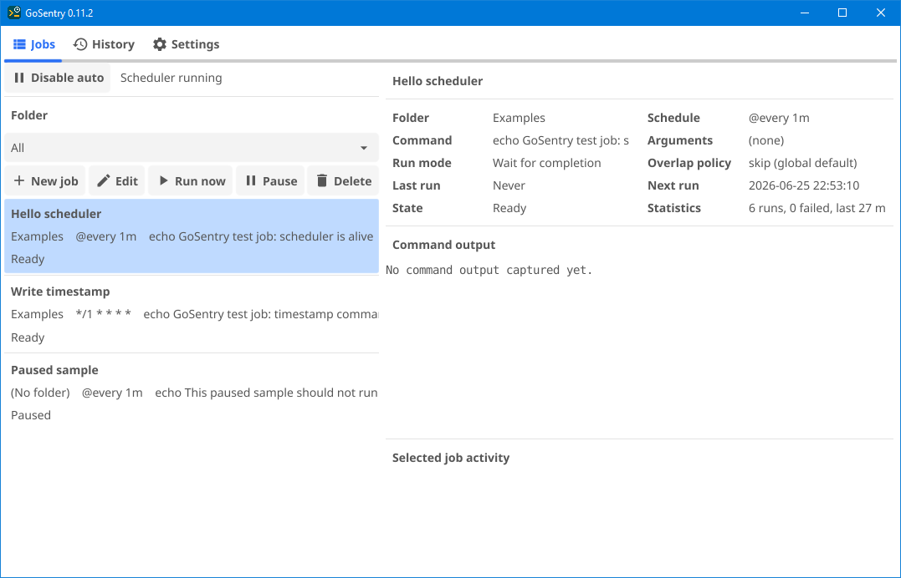
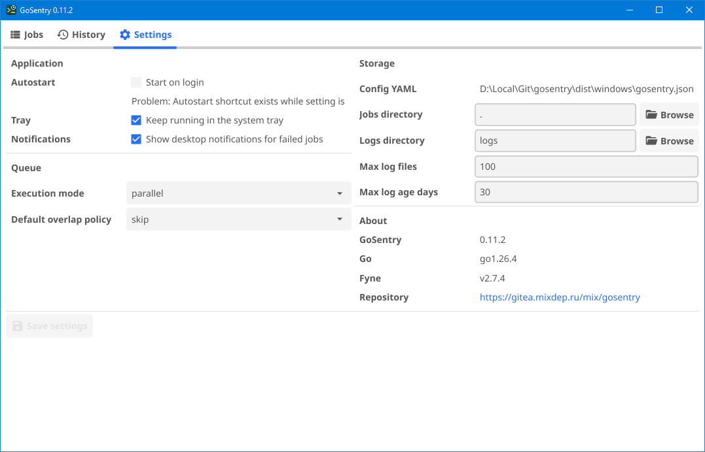

<p align="center">
  <picture>
    <source media="(prefers-color-scheme: dark)" srcset="assets/logo/gosentry-logo-dark.svg">
    
  </picture>
</p>

# GoSentry

GoSentry is a cross-platform desktop scheduler. It provides a native GUI for
creating, grouping, pausing, running, and monitoring scheduled shell commands.

## Screenshots

<table>
<tr>
<td align="center"><br><em>Jobs tab — job list with details panel and run statistics.</em></td>
<td align="center"><br><em>Settings tab — application, queue, storage, and version info.</em></td>
</tr>
</table>

## Features

- Native desktop GUI built with [Fyne](https://fyne.io/).
- Job definitions stored in a clean, hand-editable `jobs.json`.
- `@every` intervals and standard 5-field cron expressions.
- Manual and scheduled command runs.
- Parallel or sequential execution mode; overlap policy (skip or queue) set globally or per job.
- Run timeout, off by default, set globally or per job.
- Per-run `.log` files with stdout/stderr capture.
- Log cleanup by maximum file count and maximum age.
- Global pause/resume for scheduled job execution (manual runs remain available).
- Desktop notifications on job failure.
- Windows tray icon: left-click to show the window, right-click for the menu.
- Autostart on login (Windows shortcut; Linux XDG desktop entry).
- Detailed or compact job list, and a system or branded theme; both are remembered.

## Platforms

GoSentry is built and tested on **Windows** and **Linux**:

| Platform | Status | Notes |
|----------|--------|-------|
| Windows  | Supported | Tray icon, autostart shortcut (`.lnk`), desktop integration. |
| Linux    | Supported | Autostart via XDG desktop entry; desktop integration on X11/Wayland. |
| macOS    | Not supported | The Fyne GUI may build, but autostart and desktop integration are not implemented. |

## Documentation

- [Changelog](docs/CHANGELOG.md) — record of notable changes by version
- [Roadmap](docs/ROADMAP.md) — planned work larger than a single bug fix
- [Architecture](docs/ARCHITECTURE.md) — component interaction model
- [Standards](docs/STANDARDS.md) — quality rules and intentional behavior
- [Development](docs/DEVELOPMENT.md) — build instructions, project layout, dependencies
- [Tests](docs/TESTS.md) — test suite layout and how to run it
- [Performance](docs/PERFORMANCE.md) — measured performance findings

## Storage

GoSentry stores its files next to the executable by default, making it a
portable application: moving the program folder also moves its configuration.

`gosentry.json` stores application settings:

```json
{
  "jobs_file": "jobs.json",
  "logs_dir": "logs",
  "max_log_files": 100,
  "max_log_age_days": 30,
  "keep_running_in_tray": true,
  "notify_on_failure": true,
  "execution_mode": "parallel",
  "overlap_policy": "skip",
  "default_timeout_seconds": 0,
  "theme": "gosentry",
  "job_list_view": "detailed"
}
```

That is the file GoSentry writes on first run. `default_timeout_seconds` is the
run timeout applied to jobs that do not set their own; `0` means no timeout, and
it is written out even though it is zero, because a missing value and a
deliberate "no timeout" have to stay distinguishable in a hand-edited file.
`theme` is `system` or `gosentry` (the branded teal/amber look), and
`job_list_view` is `detailed` or `compact` — both are remembered from the
choices made in the app. Keys left at their off value (`start_on_login`,
`paused`) are omitted until they are turned on.

`jobs.json` stores job definitions:

```json
{
  "jobs": [
    {
      "id": 1,
      "name": "Hello scheduler",
      "folder": "Examples",
      "schedule": "@every 1m",
      "command": "echo GoSentry test job: scheduler is alive",
      "enabled": true
    }
  ]
}
```

`jobs_file` is the file GoSentry reads job definitions from, file name included,
so the file can be named anything. The default `"jobs.json"` is relative and
resolves to the executable's folder. An absolute path can be used when jobs
should live elsewhere, such as a shared network drive.

A `gosentry.json` from an earlier version that carries `jobs_dir` instead keeps
working: the directory is combined with `jobs.json` on load, and the file is
rewritten with `jobs_file`.

`logs_dir` is relative to the program folder when it does not start with a
drive letter or `/`.

Command output is written to separate files under `logs_dir`. File names
include the run timestamp and job name:

```text
20260614-224306_Hello_scheduler.log
```

## Schedules

GoSentry accepts two schedule forms: fixed `@every` intervals and standard
5-field cron expressions.

### `@every` intervals

Write `@every` followed by a [Go duration](https://pkg.go.dev/time#ParseDuration)
— a positive number with a unit suffix. Units can be combined in one value:

```text
@every 10s          every 10 seconds
@every 5m           every 5 minutes
@every 1h           every hour
@every 1h30m        every hour and a half (same as @every 90m)
@every 2h45m10s     hours, minutes, and seconds combined
```

Supported units:

| Unit | Meaning |
|------|---------|
| `ns` | nanoseconds |
| `us`, `µs` | microseconds |
| `ms` | milliseconds |
| `s` | seconds |
| `m` | minutes |
| `h` | hours |

`@every` does **not** support days, weeks, months, or years — those follow a
calendar, not a fixed interval. For “every day at 02:00”, “on the 1st of each
month”, or “once a year”, use a cron expression (below).

The scheduler checks due jobs once per second, so values shorter than `1s` are
accepted but will not fire faster than once a second.

### Cron expressions

Five fields: minute, hour, day-of-month, month, day-of-week.

```text
*/5 * * * *      every five minutes
0 2 * * *        every day at 02:00
30 9 * * 1-5     weekdays at 09:30
0 0 1 * *        first day of every month at midnight
0 0 1 1 *        every year on 1 January at midnight
```

Named descriptors are also accepted: `@hourly`, `@daily`, `@weekly`,
`@monthly`, `@yearly` (and `@annually`, `@midnight`).

## Using The App

1. Start GoSentry.
2. Use **New job** to create a scheduled command.
3. Set **Schedule**, **Command**, optional **Arguments**, **Folder**, and **Enabled**.
4. Use **Run now** for a one-off manual run without waiting for the schedule.
5. Use **Pause** on a single job to suspend it without deleting it.
6. Use **Pause all** as a global stop switch for all scheduled runs.
7. Open **History** to see past runs, their trigger (`Manual`, `Schedule`, or `UI`), state, and log file.
8. Open **Settings** to change the storage paths, log cleanup limits, queue behavior, and notifications.

The **Jobs file** row picks the file itself: **Browse** lists `.json` files, and
a path can also be typed to name a file that does not exist yet. What Save does
depends on whether that file is already there:

- **The file exists** — its jobs are loaded and replace the current list, so
  selecting a jobs file switches to it (another machine's file, a shared one on
  a network drive). History records how many jobs were loaded and from where.
- **The file does not exist** — the current jobs are written to it, which is how
  the jobs file is renamed or moved somewhere else.

Switching to a different jobs file is refused while a job is running, because
loading a new list discards the run state of the old one.

The **Start on login** checkbox shows an `OK` or `Problem` status. Saving with
it enabled writes an autostart entry using the current executable path.
When **Keep running in the system tray** is also enabled, the entry includes
`--start-in-tray` so scheduled jobs run after sign-in without opening the main
window. With the tray option off, autostart still works but opens the main
window normally. Changing the tray setting updates close behaviour and the
autostart entry immediately; the tray icon itself updates only after you restart
GoSentry (a Fyne limitation — see [docs/ROADMAP.md](docs/ROADMAP.md)).

## Queue Settings

Three settings in the **Queue** group of the Settings tab control how
simultaneous, overlapping, and over-long runs are handled.

**Execution mode** — applies when multiple jobs become due at the same tick:

| Value | Behaviour |
|-------|-----------|
| `parallel` (default) | All due jobs start at the same time. |
| `sequential` | Due jobs are started one after another, in the order they appear in the list. |

**Default overlap policy** — applies when a job's next scheduled run fires while
its previous run is still active:

| Value | Behaviour |
|-------|-----------|
| `skip` (default) | The new run is discarded; the running instance continues. |
| `queue` | The new run is held and starts immediately after the current run finishes. |

**Default timeout (s)** — how long a run may take before it is killed. `0` (the
default) means no limit.

The last two are defaults: a job's own dialog has an **Overlap policy** and a
**Timeout (s)** field that override them. A job that overrides nothing follows
whatever the Settings tab says, so changing a default moves every such job with
it. In `jobs.json` an override is an `overlap_policy` or `timeout_seconds` key
on the job; absent means inherit. A `"timeout_seconds": 0` on a job is an
override too — it means that job has no timeout even when the global default
sets one.

## Notifications

When **Notify on failure** is enabled in Settings, GoSentry sends a desktop
notification whenever a scheduled or manual run exits with a non-zero exit code.
The notification shows the job name and the exit code.

## Autostart

GoSentry is a user desktop application, not a system daemon, so autostart is
configured per user.

Linux:

```ini
# GoSentry writes an XDG Autostart desktop entry when Start on login is enabled.
~/.config/autostart/gosentry.desktop

[Desktop Entry]
Type=Application
Name=GoSentry
Exec=/opt/gosentry/gosentry-<version>-linux-amd64 --start-in-tray
Terminal=false
```

Windows:

```text
# GoSentry writes a shortcut to the current user's Startup folder.
# A .lnk stores the executable path as TargetPath and --start-in-tray as
# Arguments, so paths with spaces do not need fragile command-line quoting.
%APPDATA%\Microsoft\Windows\Start Menu\Programs\Startup\GoSentry.lnk
```

## Troubleshooting

### Windows, VirtualBox, RDP, And OpenGL

GoSentry uses [Fyne](https://fyne.io/), and Fyne uses GLFW/OpenGL to create the
desktop window. In a Windows virtual machine, especially when accessed through
RDP inside VirtualBox, the available video driver can fail OpenGL initialization.

Typical error:

```text
Fyne error: window creation error
Cause: APIUnavailable: WGL: The driver does not appear to support OpenGL
```

Known workaround:

1. Download a Windows Mesa build from
   [mesa-dist-win](https://github.com/pal1000/mesa-dist-win/releases). Use the
   archive named like `mesa3d-<version>-release-mingw.7z` — this matches the
   MSYS2 GCC toolchain used to build GoSentry. The `devel`, `debug-info`,
   `tests`, and checksum files are not needed.
2. Open the archive and use the `x64` build.
3. Copy the Mesa OpenGL DLL files from `x64` into the same directory as the
   GoSentry `.exe`:

```text
dist\windows\
  gosentry-<version>-windows-amd64.exe
  opengl32.dll
  ...
```

Mesa's software OpenGL implementation lets the Fyne window start even when the
VirtualBox/RDP driver does not provide usable OpenGL.

## Development assistance

Parts of this project were developed with assistance from [Cursor](https://cursor.com/) AI (Composer agent)
and [Claude Code](https://claude.com/claude-code).
