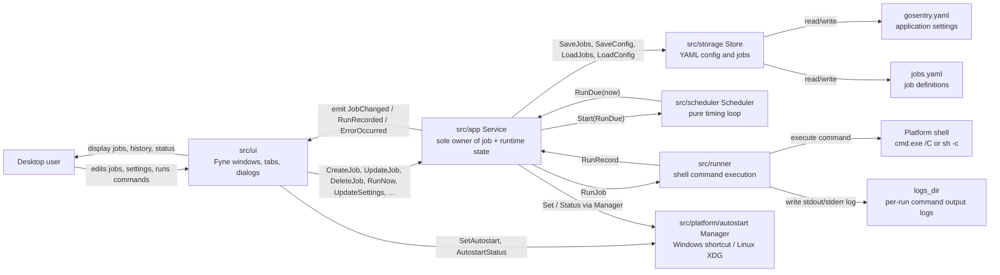

# GoSentry Architecture

This document shows the current component interaction model. GoSentry is a
single desktop process: the GUI, application service, scheduler, storage, and
command runner live in one application. They communicate through typed events
and well-defined interfaces rather than shared mutable state.

## Package Map

```
cmd/gosentry            entry point — starts the UI
src/
  domain/               pure value types: Job, Config, RunRecord, Schedule, JobRuntime
  app/                  Service — sole owner of job/runtime state; emits typed Events
  scheduler/            pure timing loop; calls app.Service.RunDue on every tick
  runner/               shell command execution + log file writing + cleanup
  storage/              YAML persistence (gosentry.yaml, jobs.yaml)
  platform/
    autostart/          Manager interface + Windows (shortcut) and Linux (XDG) impls
    desktop/            display-scale helper (Linux only)
    winproc/            hidden-window startup flags (Windows only)
  ui/                   Fyne windows, tabs, and dialogs; reads service via Events
```

## Component Diagram



## Main Flows

1. Startup:
   `cmd/gosentry` calls `ui.Run`, which creates an `app.Service`, opens the
   store, loads `gosentry.yaml` and `jobs.yaml`, subscribes the UI to service
   events, builds the main window, and calls `Service.Start` to begin the
   scheduler loop.

2. Editing settings or jobs:
   The UI calls mutating methods on `app.Service` (e.g. `CreateJob`,
   `UpdateJob`, `UpdateSettings`). The Service validates the request, updates
   its in-memory state, persists through `storage.Store`, and emits a typed
   `Event`. The UI's observer receives the event and refreshes the relevant
   widget on the main thread via `fyne.Do`.

3. Scheduled run:
   `scheduler.Scheduler` fires a tick every second. On each tick it calls
   `Service.RunDue(now)`. The Service checks which enabled, non-paused jobs are
   due, marks each as running, and launches `runner.RunJob` in a goroutine.

4. Manual run:
   `Run now` in the UI calls `Service.RunNow`. The Service checks that the job
   exists, is not already running, and that the scheduler is not paused, then
   executes `runner.RunJob` with the `Manual` trigger.

5. Command execution:
   `runner.RunJob` builds the platform-specific invocation, executes the
   command through the platform shell, captures stdout and stderr, writes one
   timestamped `.log` file, and returns a `domain.RunRecord`.

6. History update:
   When a run goroutine completes, `Service` updates the job's runtime, saves
   YAML, triggers log cleanup, and emits `RunRecorded`. The UI observer appends
   the record to the History tab.

7. Autostart:
   `UpdateSettings` in the Service calls `autostart.Manager.Set`. The Manager
   interface has two implementations: Windows writes a `.lnk` shortcut to the
   user Startup folder; Linux writes an XDG Autostart `.desktop` file. Both
   entries pass `--start-in-tray`.

8. Error surfacing:
   Background errors (failed YAML saves, cleanup errors) are emitted as
   `ErrorOccurred` events and displayed in the UI status area, rather than
   being silently discarded.
