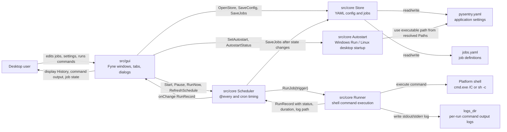

# PySentry Architecture

This document shows the current component interaction model. PySentry is still a
single desktop process: the GUI, scheduler, storage, and command runner live in
one application and communicate through Go function calls and shared in-memory
job state.

## Component Diagram

## Main Flows

1. Startup:
   The executable starts `cmd/pysentry`, which calls the GUI package. The GUI
   opens the store, loads `pysentry.yaml` and `jobs.yaml`, creates the main tabs,
   then starts the scheduler with the loaded job slice.

2. Editing settings or jobs:
   The GUI updates the in-memory job/config state and asks `Store` to write YAML
   back to disk. Job definitions stay in one `jobs.yaml`; runtime command output
   is not stored there.

3. Scheduled run:
   `Scheduler` checks due jobs on a one-second ticker. When a job is due, it marks
   the job as running, saves state, and starts `Runner` asynchronously.

4. Manual run:
   `Run now` calls the same scheduler path as scheduled execution, but the
   resulting history record uses the `Manual` trigger.

5. Command execution:
   `Runner` executes the command through the platform shell, captures stdout and
   stderr, writes one timestamped `.log` file, and returns a `RunRecord`.

6. History update:
   The scheduler receives the `RunRecord`, updates the matching job, saves YAML,
   runs log cleanup, and calls the GUI callback so the `History` tab refreshes.

7. Autostart:
   The Settings tab calls the platform autostart implementation. Windows uses the
   current user's Run registry key. Linux uses a desktop-session startup entry.
