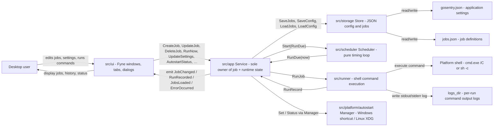

# GoSentry Architecture

This document shows the current component interaction model. GoSentry is a
single desktop process: the GUI, application service, scheduler, storage, and
command runner live in one application. They communicate through typed events
and well-defined interfaces rather than shared mutable state.

## Package Map

```
cmd/gosentry            entry point — starts the UI
src/
  domain/               pure value types: Job, Config, RunRecord, Schedule, JobRuntime
  app/                  Service — sole owner of job/runtime state; emits typed Events
  scheduler/            pure timing loop; calls app.Service.RunDue on every tick
  runner/               shell command execution + log file writing + cleanup
  storage/              JSON persistence (gosentry.json, jobs.json)
  platform/
    autostart/          Manager interface + Windows (shortcut) and Linux (XDG) impls
    desktop/            desktop entry + icon under XDG data home (Linux only)
    filemanager/        open a folder in the desktop file manager
    winproc/            hidden-window startup flags (Windows only)
  ui/                   Fyne windows, tabs, and dialogs; reads service via Events
```

## Component Diagram


```mermaid
flowchart LR
    user["Desktop user"]
    ui["src/ui - Fyne windows, tabs, dialogs"]
    svc["src/app Service - sole owner of job + runtime state"]
    store["src/storage Store - JSON config and jobs"]
    sched["src/scheduler Scheduler - pure timing loop"]
    runner["src/runner - shell command execution"]
    autostart["src/platform/autostart Manager - Windows shortcut / Linux XDG"]
    config["gosentry.json - application settings"]
    jobs["jobs.json - job definitions"]
    logs["logs_dir - per-run command output logs"]
    shell["Platform shell - cmd.exe /C or sh -c"]

    user -->|"edits jobs, settings, runs commands"| ui
    ui -->|"CreateJob, UpdateJob, DeleteJob, RunNow, UpdateSettings, AutostartStatus, …"| svc
    svc -->|"SaveJobs, SaveConfig, LoadJobs, LoadConfig"| store
    store -->|"read/write"| config
    store -->|"read/write"| jobs

    svc -->|"Start(RunDue)"| sched
    sched -->|"RunDue(now)"| svc
    svc -->|"RunJob"| runner
    runner -->|"execute command"| shell
    runner -->|"write stdout/stderr log"| logs
    runner -->|"RunRecord"| svc
    svc -->|"emit JobChanged / RunRecorded / JobsLoaded / ErrorOccurred"| ui
    ui -->|"display jobs, history, status"| user

    svc -->|"Set / Status via Manager"| autostart
```

## Platform layer

GoSentry ships one binary per target OS. Platform-specific code is not a
workaround for missing cross-platform support — it **is** the cross-platform
strategy: shared interfaces and call sites, with OS-specific implementations
selected at **compile time** (`*_windows.go`, `//go:build linux`, and similar).
Runtime `runtime.GOOS` checks appear only for small UI details (see below), not
for autostart, file-manager integration, or command invocation.

Callers (`app.Service`, `ui`, `runner`) depend on the shared API; they do not
branch on the operating system.

| Package / file | Windows | Linux | Other (`!windows && !linux`) |
| --- | --- | --- | --- |
| `platform/autostart` | Startup-folder `.lnk` shortcut | XDG `~/.config/autostart/gosentry.desktop` | Stub — `Set` returns an error when enabled |
| `platform/desktop` | no-op | Installs `.desktop` + icon under XDG data home | no-op |
| `platform/filemanager` | `explorer` | `xdg-open` | Unsupported — `Open` returns an error |
| `platform/winproc` | `CREATE_NO_WINDOW` / `HideWindow` on child processes | no-op | no-op |
| `runner/invocation_*` | `cmd.exe /S /C` with Windows-safe quoting | `sh -c` | `sh -c` (same as Linux) |

**Why separate implementations are required**

- **Autostart** — each OS defines its own login startup mechanism (shortcut,
  XDG Autostart, LaunchAgents on macOS). There is no portable API in Go, Fyne, or
  the standard library; a third-party helper would still wrap the same per-OS
  code behind an interface.
- **Opening a folder** — the desktop shell exposes no shared “reveal in file
  manager” call; each platform invokes its registered handler (`explorer`,
  `xdg-open`, `open` on macOS).
- **Command shell** — users expect OS-native semantics (`cmd.exe` batch files,
  `%VAR%`, and path rules on Windows; POSIX `sh` on Linux). A single shell for
  all platforms would break commands on one side or the other.
- **Hidden console window** — launching a child process from a GUI app can flash
  a console on Windows only; Linux and macOS do not need equivalent flags.

**Deliberate platform choices (not OS API limits)**

- **Window and tray icons** — Fyne accepts icons on every platform, but Windows
  renders the notification area and titlebar from multi-size `.ico` resources
  (embedded via `packaging/windows/gosentry.rc`), while Linux StatusNotifier
  trays scale better from a larger PNG. `ui/run.go` and `ui/tray.go` branch on
  `runtime.GOOS` for asset selection only.
- **Sample job commands** in `storage/store.go` — demo `echo` lines differ only
  because shell quoting rules differ; real jobs are user-authored per platform.

**Adding new platform code**

- Put OS integration in `src/platform/<name>/` with a small shared API, or use
  `*_GOOS.go` files in the owning package when the surface is a single function
  (as in `runner/invocation_*`).
- Do not scatter `runtime.GOOS` through `app.Service` or UI business logic.
- Unsupported platforms get an explicit stub (return an error or no-op) rather
  than silently doing nothing — see `autostart_other.go` and
  `filemanager_other.go`.

macOS autostart and file-manager handlers are not implemented yet; see
[ROADMAP.md](ROADMAP.md) for blocked or deferred cross-platform work (for
example window-maximized detection, which would need per-OS native calls).

## Main Flows

1. Startup:
   `cmd/gosentry` calls `ui.Run`, which creates an `app.Service`, opens the
   store, loads `gosentry.json` and `jobs.json`, subscribes the UI to service
   events, builds the main window, and calls `Service.Start` to begin the
   scheduler loop. On every launch the service seeds per-job run-time statistics
   from existing log files so the details panel reflects accumulated history
   immediately (see §Statistics below).

2. Editing settings or jobs:
   The UI calls mutating methods on `app.Service` (e.g. `CreateJob`,
   `UpdateJob`, `UpdateSettings`). The Service validates the request, updates
   its in-memory state, persists through `storage.Store`, and emits a typed
   `Event`. The UI's observer receives the event and refreshes the relevant
   widget on the main thread via `fyne.Do`.

   `UpdateSettings` has one extra step: when the configured jobs file changes
   and a file already exists at the new path, that file is authoritative. The
   Service loads it, calls `adoptJobsLocked` to rebuild the jobs slice, runtime
   map, schedule cache, next-run times, and log-seeded statistics around it, and
   emits `JobsLoaded` plus a broad `JobChanged`. A path with no file behind it
   receives the current jobs instead. Adoption drops all runtime state, so it is
   refused while a job is running.

3. Scheduled run:
   `scheduler.Scheduler` fires a tick every second. On each tick it calls
   `Service.RunDue(now)`. The Service checks which enabled, non-paused jobs are
   due, marks each as running, and launches `runner.RunJob` in a goroutine.

4. Manual run:
   `Run now` in the UI calls `Service.RunNow`. The Service checks that the job
   exists, is not already running, and (in sequential mode) that no other job is
   running, then executes `runner.RunJob` with the `Manual` trigger. Manual runs
   are allowed even while the scheduler is globally paused.

5. Command execution:
   `runner.RunJob` builds the platform-specific invocation, executes the
   command through the platform shell under the caller-supplied timeout, captures
   stdout and stderr, writes one timestamped `.log` file, and returns a
   `domain.RunRecord` containing
   `DurationMS` (wall-clock milliseconds from start to finish; for `StartOnly`
   fire-and-forget jobs it measures launch latency — the time to spawn the
   process — since there is no exit to wait for).

6. History update:
   When a run goroutine completes, `Service` updates the job's runtime
   (including the statistics aggregate), saves JSON, triggers log cleanup, and
   emits `RunRecorded`. The UI observer appends the record to the History tab.
   History rows exist only for the current process session; restarting the app
   clears the table (aggregate stats in the details panel are still seeded from
   log files).

7. Autostart:
   `UpdateSettings` in the Service calls `autostart.Manager.Set`. The Manager
   interface has two implementations: Windows writes a `.lnk` shortcut to the
   user Startup folder; Linux writes an XDG Autostart `.desktop` file. When
   `KeepRunningInTray` is enabled the entry passes `--start-in-tray`; when it is
   off the entry launches the executable without that flag so the main window
   opens after sign-in.

8. Error surfacing:
   Background errors (failed JSON saves, cleanup errors) are emitted as
   `ErrorOccurred` events and displayed in the UI status area, rather than
   being silently discarded.

## Key Domain Concepts

### Per-job overlap policy

`domain.Job` carries an `OverlapPolicy` field (`json:"overlap_policy,omitempty"`).
When non-empty it overrides the global `Config.OverlapPolicy` for that job alone.
Empty means inherit the global default. `app.Service.RunDue` resolves the
effective policy per job: it uses `job.OverlapPolicy` when set, otherwise falls
back to `store.Config.OverlapPolicy`. `normalizeJob` in `app/operations.go` leaves
the field empty on new jobs so the inherit semantics are preserved.

Under the `"queue"` policy, each occurrence that fires while a run is still
in flight increments `JobRuntime.PendingRuns`. When the current run finishes,
`executeRun` drains the counter by starting one deferred run per completion until
`PendingRuns` reaches zero.

### Per-job command timeout

`domain.Job` carries a `TimeoutSeconds *int` field
(`json:"timeout_seconds,omitempty"`), following the same inherit pattern as the
overlap policy. It is a **pointer** because the setting has three states that
must stay distinguishable on disk:

| `Job.TimeoutSeconds` | jobs.json | Meaning |
| --- | --- | --- |
| `nil` | field absent | inherit `Config.DefaultTimeoutSeconds` |
| `0` | `"timeout_seconds": 0` | no timeout, does **not** inherit |
| `> 0` | `"timeout_seconds": 45` | per-job limit in seconds |

The global `Config.DefaultTimeoutSeconds` (default **0**, i.e. no timeout) is
written unconditionally — no `omitempty` — for the same reason: `0` there is a
deliberate choice, not a missing value, and `storage.loadOrCreateConfig` must not
normalize it away. `app.Service.effectiveTimeout`
resolves the effective duration under `mu` and `startRunLocked` snapshots it into
`runEnv.timeout`. `runner.RunJob(ctx, job, trigger, logsDir, timeout)` takes the
resolved duration as an argument, so the runner stays ignorant of the global
config: a positive duration applies the timeout via `context.WithTimeout` and
reports `Timed out after <timeout>` on expiry; a non-positive duration runs
without a deadline, bounded only by `ctx` (app shutdown). `StartOnly` jobs run on
the untimed context and so measure launch latency only, unaffected by the run
timeout.

### Run-time statistics

`domain.JobRuntime` holds a rolling aggregate updated after each run:

| Field | Meaning |
|-------|---------|
| `RunCount` | total runs recorded |
| `FailCount` | runs that exited non-zero |
| `LastDurationMS` | wall-clock time of the most recent run (launch latency for `StartOnly`) |
| `AvgDurationMS` | mean over all runs with a recorded duration |
| `MaxDurationMS` | longest recorded run |

`runner.RunJob` measures the wall-clock start→finish and sets `DurationMS` on
the returned `RunRecord`. `runner/logfile.go` writes a `duration` line into the
log file header alongside the existing `state` line.

On startup, `runner.SeedStats` scans log files (matched primarily by the
`job_id` header, with a sanitized-name filename fallback for legacy logs,
bounded by `Config.MaxLogFiles`) and folds the parsed `state`/`duration`
headers into a `runner.SeededStats` map. `NewService` applies those seeds to
the runtime map before the first scheduler tick, so the details panel shows
accumulated run history immediately after a restart.
Older log files that pre-date the `duration` header are tolerated: the run is
counted but the timing is skipped.

`JobRuntime.Logs` (per-run `RunRecord` entries shown in the History tab) is
**session-only**: it is not written to `jobs.json` and is not rebuilt from
`.log` files on startup. Log files on disk feed aggregate counters via
`SeedStats` only. See [STANDARDS.md](STANDARDS.md).

### Persisted global pause

`domain.Config` carries a `Paused bool` field (`json:"paused,omitempty"`).
`app.Service.SetGlobalPause` writes the new value into `store.Config` and calls
`SaveConfig`, so the paused state survives a restart. `NewService` initialises
`s.paused` from `store.Config.Paused` and applies the paused next-run text to
all runtimes before the first tick, ensuring the UI shows the correct state from
the moment the window opens.

### `jobs_view.go` file structure

The size guideline for a file in this project is ~250 lines.
`src/ui/jobs_view.go` is split across three files along these seams; the view
file itself has grown back over the guideline since — see the split item in
[ROADMAP.md](ROADMAP.md), which tracks every file currently over it:

| File | Contents |
|------|----------|
| `jobs_view.go` | `newJobsView` — list, toolbar, button wiring, and layout |
| `jobs_view_details.go` | `detailsPanel` struct — widget creation, `update`, `clear`, `container` |
| `jobs_view_helpers.go` | Pure helpers — `filteredJobIndexes`, `folderOptions`, `filterValue`, `indexOfID`, `lastJobLogs`, `nextJobListView`, `viewToggleText` |

### `settings_view.go` file structure

`src/ui/settings_view.go` is split across three files the same way, once its
own size passed the guideline:

| File | Contents |
|------|----------|
| `settings_view.go` | `settingsView` — field construction, save, load, validate; the Theme label translation helpers |
| `settings_view_layout.go` | `newSettingsLayout`, `settingsSection`, `settingsRow` — the two-column arrangement and the button row |
| `settings_view_helpers.go` | Pure helpers — `fyneVersion`, `mustParseURL`, `settingsFolderPath`, `openFolder`, `chooseFile`/`chooseJSONFile`, `chooseFolder` (`chooseFile` also backs `job_dialog.go`'s command browser) |
